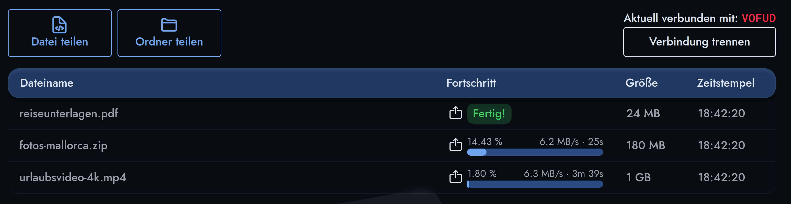
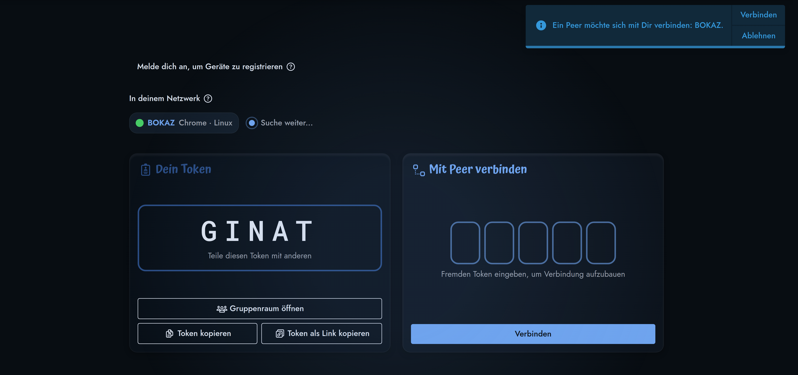

# PeerDrop

**Dateien direkt von Peer zu Peer, ohne Upload und ohne Konto.**
Läuft im Browser unter [peerdrop.de](https://peerdrop.de).

## Die Cloud will deine Dateien. PeerDrop nicht.

Hochladen heißt Risiko: die Dateien liegen lesbar beim Anbieter, nach dem Löschen bleiben Kopien in seinen Backups.
Der Freigabe-Link öffnet sie für jeden, der ihn weiterbekommt.
Bei PeerDrop gehen deine Dateien direkt zum anderen Peer, sonst nirgendwohin.

## In Sekunden verbunden

1. Beide Peers öffnen peerdrop.de und bekommen je einen fünfstelligen Token.
2. Token weitergeben, per Kopierknopf oder als Link auf `peerdrop.de/connect?token=ABCDE`.
3. Angezeigten Token vergleichen, Verbindung zulassen.
4. Dateien und Ordner draufziehen. 🚀

Peers im selben Netzwerk werden dir ohne Token angezeigt, ein Klick stellt die Verbindung her.

## Unsere Server sehen deine Dateien nie

Echte Ende-zu-Ende-Verschlüsselung, direkt zwischen den beiden Browsern.
Unsere Server vermitteln die Verbindung und bekommen deine Dateien nie zu Gesicht, also kann sie dort auch niemand lesen.
Genau das heißt P2P.
Sperrt eine Firewall den direkten Weg, reicht ein Relay die Pakete weiter, verschlüsselt und für das Relay unlesbar.

## Gut zu wissen

Beide Peers müssen gleichzeitig auf peerdrop.de sein.
Tab zu heißt Übertragung neu.

## Lizenz

MIT, siehe [LICENSE](LICENSE).
Am Code mitarbeiten: [CONTRIBUTING](docs/CONTRIBUTING.md).
