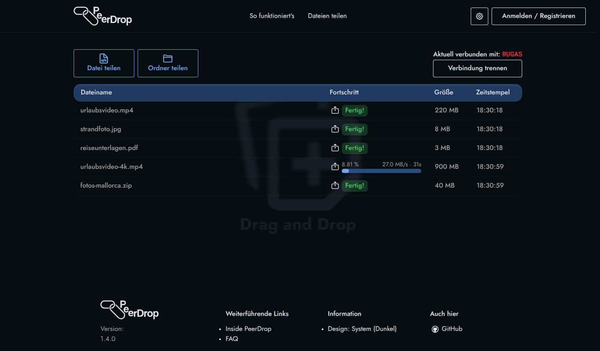
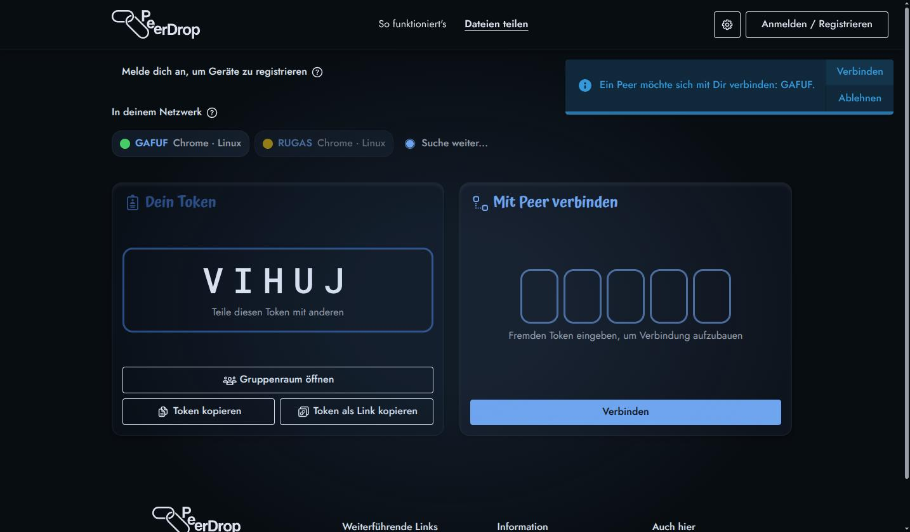

# PeerDrop

Dateien direkt von Gerät zu Gerät übertragen, im Browser unter [peerdrop.de](https://peerdrop.de).
Die Datei geht aus dem einen Browser in den anderen, ohne Zwischenstation.

## Was der Weg über die Cloud kostet

Beim Hochladen gibst du die Datei aus der Hand: sie liegt beim Anbieter, lesbar für ihn, bis jemand sie löscht.
Nach dem Löschen bleibt offen, wie lange Backups und Caches die Kopie noch halten.
Der Freigabe-Link öffnet die Datei für jeden, der ihn bekommt, und ein Link lässt sich weiterschicken.
Wer davon Gebrauch gemacht hat, erfährst du nicht.

## So läuft eine Übertragung

1. Beide Seiten öffnen peerdrop.de und bekommen je einen fünfstelligen Token.
2. Gib deinen Token weiter, per Kopierknopf oder als Link auf `peerdrop.de/connect?token=ABCDE`.
3. Die Gegenseite fragt damit an, du vergleichst den angezeigten Token und lässt die Verbindung zu.
4. Zieh Dateien und Ordner auf die Seite. 🚀

Geräte im selben Netzwerk stehen ohne Token in einer Liste, ein Klick genügt.
Mit einem Konto stehen dort deine eigenen Geräte unter selbst vergebenen Namen.

## Was die Server sehen

Ein Server von PeerDrop bringt die beiden Browser zusammen und reicht dafür ihre Verbindungsdaten durch.
Die Übertragung läuft verschlüsselt über WebRTC, und die Schlüssel handeln die Browser unter sich aus.
Lässt ein Router keinen direkten Weg zu, reicht ein Relay die verschlüsselten Pakete weiter, für das Dateiname und Inhalt unlesbar bleiben.
Auf keinem der Server bleibt eine Datei zurück.

## Grenzen

Eine Übertragung braucht beide Geräte gleichzeitig auf peerdrop.de.
Schließt du den Tab, bricht sie ab und beginnt beim nächsten Anlauf von vorn.

## Lizenz

MIT, siehe [LICENSE](LICENSE).
Am Code mitarbeiten: [CONTRIBUTING](docs/CONTRIBUTING.md).
