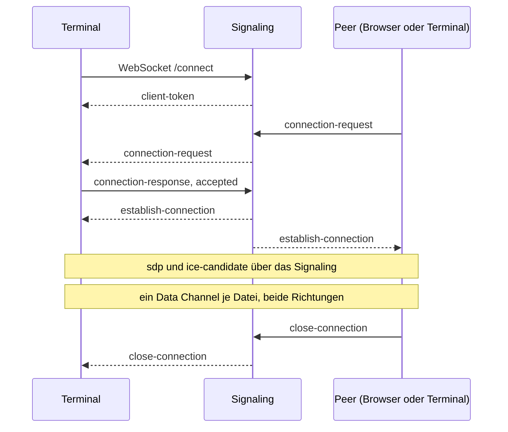

# Kommandozeilen-Client

Entwurf eines Clients, der eine PeerDrop-Sitzung im Terminal führt: Dateien vom Rechner zum Peer und vom Peer auf den Rechner.
Auf dem Rechner ist nichts vorinstalliert außer `curl` und `sh`, unter Windows PowerShell.
Der Client spricht dasselbe Signaling und dasselbe WebRTC-Protokoll wie die Webseite, so dass Browser und Terminal beliebig gemischt werden.

## Aufruf

Linux:

```sh
curl -fsSL https://peerdrop.de/cli | sh
curl -fsSL https://peerdrop.de/cli | sh -s -- babab ./report.pdf
```

Windows (PowerShell):

```powershell
irm https://peerdrop.de/cli.ps1 | iex
& ([scriptblock]::Create((irm https://peerdrop.de/cli.ps1))) babab C:\report.pdf
```

Das Skript lädt die Binärdatei für das erkannte System in den Cache-Ordner und startet sie mit den übergebenen Argumenten.
Das Skript nennt den Pfad der Binärdatei, so dass sie ohne erneuten Einzeiler aufrufbar ist.

```
peerdrop [TOKEN] [DATEI...] [--dir ORDNER] [--name NAME] [--stdout] [--exit-after-send] [--overwrite] [--host URL] [--quiet]
```

Ohne TOKEN wartet der Client auf eine eingehende Verbindung und zeigt das eigene Token.
Mit TOKEN verbindet er sich mit dem Peer.
DATEI... wird nach dem Verbindungsaufbau nacheinander gesendet.
Eingehende Dateien landen in `--dir`, standardmäßig im aktuellen Ordner.
`-` als DATEI liest die Standardeingabe, gespoolt in eine temporäre Datei, und sendet sie unter `--name` oder `stdin`.
`--stdout` schreibt die erste eingehende Datei auf die Standardausgabe und beendet die Sitzung danach.
`--host` wählt eine andere Instanz, Standard ist der Host, von dem das Skript geladen wurde.

## Sitzung



Der Client bestätigt eine eingehende Verbindungsanfrage ohne Rückfrage.
Eine zweite Anfrage während einer laufenden Sitzung wird abgelehnt.
Beide Seiten senden gleichzeitig: ausgehende Dateien nacheinander, eingehende parallel.
Die Sitzung endet mit `close-connection` des Peers, mit `quit` oder Strg+C, oder nach `--exit-after-send`, sobald die letzte Datei gesendet ist.
Exit-Code 0, wenn alle Transfers abgeschlossen sind, 1 bei mindestens einem Fehlschlag, 2 bei falschem Aufruf, 3 ohne Verbindung.

## Ausgabe

Fortschritt und Status gehen auf stderr, Dateidaten nur mit `--stdout` auf stdout.
Auf einem Terminal wird pro aktivem Transfer eine Zeile fortgeschrieben, darunter die Eingabezeile:

```
Your token: BABAB
Open https://peerdrop.de/connect in a browser and enter it.
From another terminal: curl -fsSL https://peerdrop.de/cli | sh -s -- babab

Connected to KUZOK.
up    report.pdf               [##########----------]  52%   12.3 MB/s  0:04
down  photo.jpg                [####----------------]  21%    4.1 MB/s  0:12
>
```

Auf der Eingabezeile wird je ein Pfad pro Zeile gesendet, `~` und Glob-Muster löst der Client selbst auf.
Ohne Terminal auf stdin entfällt die Eingabezeile, und pro Datei erscheint eine Start- und eine Endzeile.

## Eingehende Dateien

Der Dateiname ist der Basename des gesendeten Namens, ein leerer Name wird zu `received-file`.
Geschrieben wird nach `NAME.part`, umbenannt nach vollständigem Empfang.
Ein vorhandener Name erhält ein numerisches Suffix, `--overwrite` ersetzt.
Ein abgebrochener Transfer löscht seine `.part`-Datei.

## Entwicklung

Der Client ist ein Go-Modul in diesem Ordner.
`go` steht im Nix-DevShell des Repositories bereit.

```sh
go build -o peerdrop .
go test ./...
gofmt -l . && go vet ./...
```

Die Tests bauen zwei Peers im selben Prozess auf und schicken Dateien zwischen ihnen.
Ein Signaling-Server im Testprozess übernimmt die Vermittlung, mit derselben Frame-Grenze wie das Backend.
Kein Test erreicht eine Adresse außerhalb des Rechners.

## Weitere Seiten

- [Analyse](docs/analyse.md): warum eine heruntergeladene Binärdatei, und was ein Peer ohne Browser nachbauen muss.
- [Protokoll](docs/protokoll.md): Signaling, Verbindungsaufbau und Dateiformat auf dem Draht.
- [Auslieferung](docs/auslieferung.md): Bootstrap-Skripte, Release-Artefakte, Versionierung.
- [Entscheidungen](docs/entscheidungen.md): festgelegte Punkte des Entwurfs.
