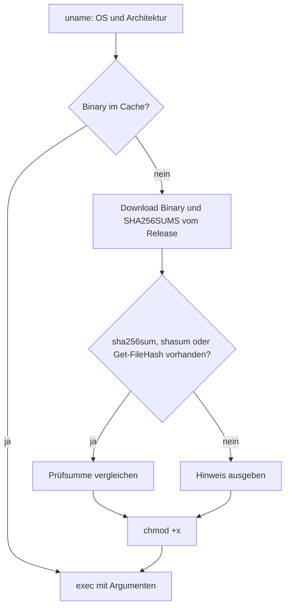

# Auslieferung

Wie Skript und Binärdatei vom Release zum Rechner kommen.

## Skripte

Die Bootstrap-Skripte liegen als `frontend/public/cli` und `frontend/public/cli.ps1` und werden von nginx unter `/cli` und `/cli.ps1` ausgeliefert, `Content-Type: text/plain`, `Cache-Control: no-cache`.
`text/plain` ist Pflicht: `irm` liefert für `application/octet-stream` ein Byte-Array, mit dem `iex` scheitert.
Beim Containerstart setzt `entrypoint.sh` per `envsubst` Host und Schema der Instanz ein, beim Image-Build ersetzt das Dockerfile den Versionsplatzhalter durch `VITE_APP_VERSION`.
Ein unersetzter Platzhalter, etwa unter `vite dev`, lädt aus `releases/latest/download`.



Cache-Ordner in dieser Reihenfolge: `$XDG_CACHE_HOME/peerdrop/<version>/`, `$HOME/.cache/peerdrop/<version>/`, `mktemp -d`.
Unter Windows `%LOCALAPPDATA%\peerdrop\<version>\`.
Scheitert `exec` an `noexec`, versucht das Skript den nächsten Ordner und nennt bei Erschöpfung alle drei.
Der Cache ist nach Version benannt, so dass ein Deployment mit neuem Protokoll beim nächsten Einzeiler die passende Binärdatei zieht.

## Artefakte

Ein Release des Repositories trägt die Binärdateien als Assets:

```
peerdrop-linux-amd64
peerdrop-windows-amd64.exe
SHA256SUMS
```

Der Job in `.github/workflows/cd.yml` baut sie mit `GOOS` und `GOARCH`, lädt sie mit `gh release upload` hoch und braucht dafür `contents: write`.
Der Deploy-Schritt wartet auf den Job, so dass `/cli` auf keine fehlenden Assets zeigt.
Version des Clients ist der Release-Tag, `peerdrop --version` gibt ihn aus.

## Prüfung vor dem Merge

`.github/workflows/cli.yml` läuft auf Pull Requests:

- `gofmt -l`, `go vet`, `go test` für Framing, Namensbereinigung und SDP-Kürzung.
- Integrationstest: Backend aus `docker-compose.yml`, zwei Client-Prozesse auf dem Runner, Senden mit und ohne Token, Vergleich der Prüfsummen.
- `windows-latest`: Build und `peerdrop.exe --version`.

Der Test gegen einen echten Browser ist eine Checkliste je Release: Browser sendet an Terminal, Terminal sendet an Browser, beides gleichzeitig.

## Entwicklungsumgebung

`flake.nix` stellt `go` bereit.
Formatierung und Prüfung laufen mit `gofmt` und `go vet`.
