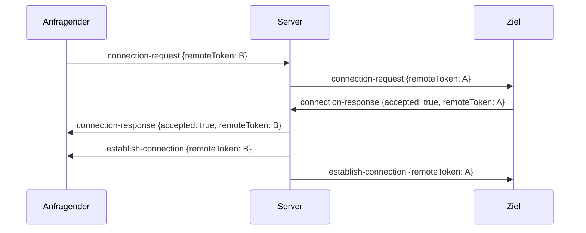

# Protokoll

Was ein Peer ohne Browser auf dem Draht spricht, damit der Browser ihn wie einen zweiten Browser behandelt.

## Signaling

Die Adresse des Backends steht in `/envvars.json` der Instanz unter `wsBackendUrl`, die ICE-Server unter `iceServers`.
Der WebSocket läuft auf `<wsBackendUrl>/connect` ohne Anmeldung.
Jede Nachricht ist ein JSON-Objekt `{"type": ..., "msg": {...}}` in einem Frame von höchstens 1024 Byte.
Die erste Nachricht vom Server ist `client-token` mit dem eigenen Token: fünf Kleinbuchstaben als Proquint, gültig bis zum Ende der WebSocket-Verbindung.

| Typ | Richtung | `msg` |
|---|---|---|
| `client-token` | Server an Client | `{"token"}` |
| `connection-request` | Client an Server, Server an Ziel | `{"remoteToken"}` |
| `connection-response` | Client an Server, Server an Anfragenden | `{"accepted", "remoteToken"}` |
| `connection-request-cancelled` | Client an Server, Server an Ziel | `{"remoteToken"}` |
| `establish-connection` | Server an beide | `{"remoteToken"}` |
| `sdp` | Client an Server, Server an Peer | `{"remoteToken", "description"}` |
| `ice-candidate` | Client an Server, Server an Peer | `{"remoteToken", "iceCandidate"}` |
| `close-connection` | Client an Server, Server an Peer | `{"remoteToken"}` |

`remoteToken` trägt beim Senden das Ziel und beim Empfang den Absender.
`description` und `iceCandidate` reicht der Server unverändert durch, in der Form, die der Browser aus `RTCSessionDescription` und `RTCIceCandidate` serialisiert.
Ein Token wird kleingeschrieben verglichen und großgeschrieben angezeigt.

## Verbindungsaufbau



Ein unbekanntes Ziel beantwortet der Server sofort mit `connection-response` und `accepted: false`.
Mit `establish-connection` bauen beide Seiten die WebRTC-Verbindung auf.
Die höfliche Seite ist die mit dem lexikografisch kleineren Token.
Sie legt einen Data Channel mit dem Label `init` an, stellt dadurch das erste Angebot, und die Gegenseite antwortet.
Der Kanal `init` trägt keine Daten und wird vom Empfänger ignoriert.
Weitere Kanäle brauchen keine neue Verhandlung.

## Dateiformat

Jede Datei bekommt einen eigenen Data Channel: Label ist eine UUID, `ordered: false`, zuverlässig, `binaryType` `arraybuffer`.
Die erste Nachricht ist ein JSON-String:

```json
{"name": "report.pdf", "size": 1048576, "uuid": "b6f2c1e0-4a3d-4c8e-9f1a-2d7c5e8b9a10", "chunkCount": 5, "chunkSize": 262140}
```

Danach folgen Binärnachrichten: vier Byte Sequenznummer als `uint32` little-endian, dann die Nutzdaten.
`chunkSize` ist die Nutzdatenlänge einer vollen Nachricht: die kleinere von 256 KiB und der vom Gegenüber angekündigten SCTP-Maximalgröße, ohne Ankündigung 16 KiB, minus vier Byte.
`chunkCount` ist `ceil(size / chunkSize)`, die letzte Nachricht ist kürzer.

Der Empfänger schreibt die Nutzdaten an Position `sequence * chunkSize`, zählt Nachrichten und ist fertig, wenn der Zähler `chunkCount` erreicht.
Nachrichten vor den Metadaten werden zwischengespeichert und nach deren Eintreffen verarbeitet.
Der Sender hält seinen Puffer zwischen 2 MiB und 8 MiB, wartet nach der letzten Nachricht, bis der Puffer leer ist, und schließt den Kanal.
Ein Schließen vor Erreichen von `chunkCount` bedeutet Abbruch.
Es gibt keine Bestätigung vom Empfänger.
Mehrere Dateien laufen auf mehreren Kanälen gleichzeitig.
