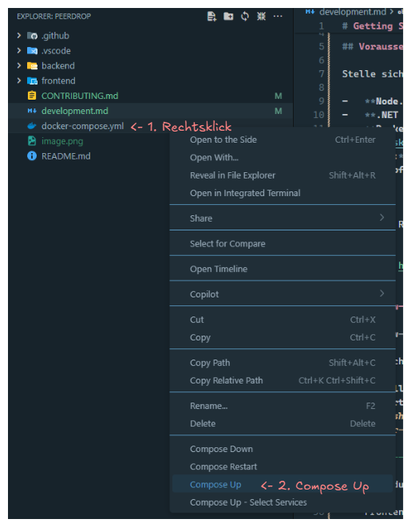

# Getting Started Development

Dieses Dokument beschreibt, wie eine lokale Entwicklungsumgebung für PeerDrop eingerichtet wird.

## Voraussetzungen

Stelle sicher, dass die folgenden Programme auf deinem System installiert sind:

-   **Node.js:** Für das Frontend. ([Download Node.js](https://nodejs.org/) oder `winget install OpenJS.NodeJS`)
-   **.NET SDK Version 9.0:** Für das Backend. ([Download .NET SDK](https://dotnet.microsoft.com/download) oder `winget install Microsoft.DotNet.SDK.9`)
-   **Docker und Docker Compose:** Für die Containerisierung und die einfache Einrichtung der gesamten Umgebung. ([Download Docker](https://www.docker.com/products/docker-desktop/))
-   **Git:** Zur Versionskontrolle. ([Download Git](https://git-scm.com/downloads))
-   **(Empfehlung) VSCode** Für die Frontendentwicklung. (`winget install Microsoft.VisualStudioCode`)
-   **(Empfehlung) JetBrains Rider** Für die Backendentwicklung. (`winget install JetBrains.Rider`)

## Setup

Klone das Repository, falls noch nicht geschehen:

```bash
git clone https://github.com/bjoern621/PeerDrop.git
```

### 1. Review-Umgebung

Die Review- (Stage-) Umgebung basiert auf einer einzigen Docker Compose Datei. Um den Branch schnell zu testen kann Docker Compose Up direkt in VSCode genutzt werden:



In der Review-Umgebung sind folgende Schnittstellen verfügbar:

-   Frontend: `http://localhost:80`
-   Backend: `http://localhost:8080`
-   Postgres Datenbank: `localhost:5432`

### 2. Entwicklung

Während der aktiven Entwicklung sollte nicht mit der Docker Compose Datei gearbeitet werden, da diese z.B. kein [Hot Reload](https://www.it-intouch.de/glossar/hot-reload/) unterstützt. Die Umgebung für die Entwicklung kann wie folgt eingerichtet werden.

_Frontend_

1. Führe `npm install` in `<base_dir>/frontend/` aus.
2. Starte das Frontend z.B. **F5**-Taste in VSCode.
3. Frontend ist unter `http://localhost:5173` verfügbar.

---

_Backend_

1. Öffne das Backend in JetBrains Rider. (**Öffne die .sln-Datei unter `<base_dir>/backend/backend.sln` nicht das gesamte Projekt!**)
2. Starte das Backend über die Konfiguration oben rechts:


3. Das Backend ist verfügbar unter `http://localhost:5023`.

---

_Datenbank_

1. Nutze "Compose Up - Select Services" in VSCode und wähle nur die Datenbank aus.
2. Die lokale Entwicklungsdatenbank ist unter `localhost:5432` verfügbar.

Die Datenbank muss noch mit dem richtigen Schema geladen werden:

1. In Rider öffne **View** > **Tool Windows** > **Database**.
2. Klicke **Connect to database...**.
3. Wähle **Add data source manually** und **Next**.
4. Suche **PostgreSQL** als **Data source** aus und wähle **Next**.
5. User: **postgres** und Password: **passwort**, dann **Connect to Database**.
6. Im Database Menü auf **New** (+) und **DDL Data Source**.
7. **Add directories or DDL files**, wähle den Ordner `<base_dir>/backend/backend/database_ddl/`, dann **OK**.
8. Wähle **Properties** (DB Symbol, rechts neben +) > **DDL Mappings**.
9. Füge ein neues Mapping zwischen **postgres@localhost** und **DDL data source** hinzu.
10. Wähle unter **Scope** **peerdrop** > **public** aus. (Drücke **Refresh** (Kreis Symbol), wenn **public** nicht angezeigt wird.)
11. Drücke **OK**. Wähle **Later**.
12. Rechtsklick auf **postgres@localhost** > **DDL Mapping** > **Apply from ...** > **Execute**.
13. Wähle **Properties** > **postgres@localhost** > **Schemas**.
14. Entferne alle Haken und setze den Haken bei **peerdrop** > **public**. Wähle **OK** und **Yes**.

Jetzt ist die Entwicklungsumgebung komplett eingerichtet.

Teste zum Beispiel

-   `http://localhost:5173/fetch`
-   `http://localhost:5032/weatherforecast`
-   Lasse dir die users Tabelle anzeigen: postgres@localhost > peerdrop > public > tables > users (Doppelklick)
